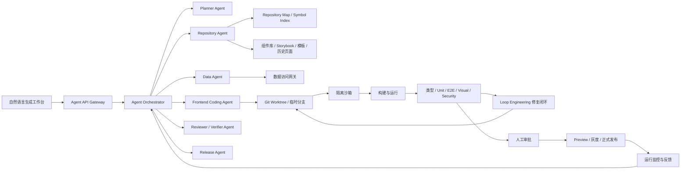
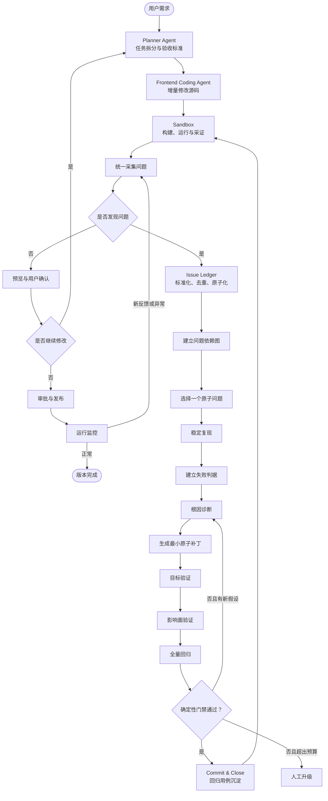

# 自然语言大屏 Agent：总体架构与实施计划

> 方案定位：**Source Code First + Multi-Agent + Loop Engineering**  
> 核心目标：让用户通过自然语言创建和持续修改数据大屏，由 Agent 直接复用现有组件并增量修改 Vue / TypeScript / CSS / ECharts 源码，通过沙箱、测试、安全门禁、人工审批和 Git 版本管理控制质量与风险。

---

## 1. 项目目标

建设一个通过自然语言生成和持续修改数据大屏的 Agent 系统，覆盖以下能力：

- 根据自然语言创建单页数据大屏。
- 理解行业、业务角色、指标、数据源、分辨率、主题和交互要求。
- 检索并复用已有页面、组件、类型、Storybook 示例和历史代码。
- 直接生成或增量修改 Vue、TypeScript、CSS 和 ECharts 源码。
- 绑定受控数据接口、Mock 数据和语义指标。
- 根据用户后续对话持续局部修改，而不是重新生成整个项目。
- 在隔离沙箱中构建、运行、截图和测试。
- 自动发现、复现、诊断和修复代码、数据、交互、视觉与安全问题。
- 使用 Git 保存每轮修改，支持差异审查、版本回退、预览和灰度发布。
- 对数据权限、依赖、安全扫描和生产发布执行确定性门禁。

### 1.1 第一阶段建议范围

输入：

- 自然语言需求。
- 已注册的数据源或 Mock 数据。
- 现有 Vue 工程与组件库。
- 可选的主题和行业模板。

输出：

- 单页 1920×1080 大屏。
- 12～15 种标准组件组合。
- 筛选、联动、刷新和下钻。
- 实时预览、持续对话修改、保存和发布。

第一阶段暂不支持：

- Agent 直接连接生产数据库。
- Agent 自由编写和执行任意 SQL。
- Agent 自由安装任意 npm 包。
- 多页面复杂业务系统。
- 无约束的第三方代码执行。
- 复杂 3D、WebGL 或 GIS 编辑器。

---

## 2. 核心技术路线

本方案不采用 Dashboard DSL 作为主路线，而采用：

> **Source Code First：Agent 直接操作现有前端工程源码，组件物料以源码、TypeScript 类型、Storybook、测试和历史用法为事实来源。**

总体链路：

```text
自然语言需求
  → 需求规划
  → 仓库与组件检索
  → 数据与权限解析
  → 增量修改 Vue / TS / CSS / ECharts
  → 沙箱构建与运行
  → 截图、测试与安全扫描
  → 原子问题修复闭环
  → Git Commit
  → 预览与人工审批
  → 灰度发布与运行反馈
```

### 2.1 为什么使用 Source Code First

- 当前模型能够处理 Vue 单文件组件、TypeScript、ECharts、CSS Grid/Flex 和多文件修改。
- 源码能表达复杂联动、动画、条件渲染、自定义图形、WebSocket、地图和业务特定逻辑。
- 不需要额外维护页面 DSL、Schema、Renderer、组件映射和 DSL 版本兼容。
- 持续对话更自然，可以直接定位文件和 Symbol 做局部修改。
- Git Diff、编译、测试和截图可以作为确定性质量依据。

### 2.2 仍需保留的结构化契约

不采用页面 DSL，不代表所有信息都使用自由文本。以下内容仍应结构化：

- `RequirementSpec`：需求、指标、交互、分辨率、主题和缺失信息。
- `ChangePlan`：修改目标、文件、Symbol、操作、风险和验收条件。
- `IssueRecord`：问题、证据、复现步骤、判据、依赖和状态。
- `RepairAttempt`：根因假设、补丁范围、测试结果和失败反例。
- `ValidationReport`：Build、Type、Unit、E2E、Visual、Security 结果。
- `ApprovalRecord`：数据、依赖、权限和生产发布审批。
- `ReleaseRecord`：版本、环境、灰度策略、指标和回滚点。

这些是 Agent 工作流和审计契约，不是页面描述 DSL。

---

## 3. 总体技术架构



### 3.1 推荐技术选型

| 模块 | 推荐技术 |
|---|---|
| 用户端 | Vue 3、TypeScript、Vite、Pinia |
| 图表与大屏 | Apache ECharts、CSS Grid、现有组件库 |
| 组件资产 | Storybook、TypeScript Props、JSDoc、测试 |
| Agent 编排 | Python、FastAPI、支持工具调用与人工审批的 Agent 框架 |
| Repository Index | AST、TypeScript Language Service、Tree-sitter、全文检索 |
| 数据网关 | Go 或 Java，统一元数据、指标查询、权限和审计 |
| 元数据存储 | PostgreSQL |
| 语义与代码检索 | PostgreSQL + pgvector 或 OpenSearch |
| 对象存储 | MinIO / S3，用于截图、日志、构建产物和报告 |
| 沙箱 | Kubernetes Job、gVisor、受限 NetworkPolicy |
| 策略控制 | OPA / Gatekeeper |
| 测试 | Vitest、Playwright、视觉回归、DOM 几何检查 |
| 发布 | GitOps、Argo CD、Argo Rollouts |
| 可观测性 | OpenTelemetry、Prometheus、Grafana |

---

## 4. Multi-Agent 分工

### 4.1 Planner Agent

负责：

- 判断是新建大屏还是修改现有大屏。
- 提取目标用户、场景、指标、交互、分辨率和主题。
- 判断信息是否完整并生成关键澄清问题。
- 拆分任务、定义修改范围和验收标准。

限制：不修改代码，不猜测不存在的指标。

### 4.2 Repository Agent

负责：

- 建立和查询 Repository Map。
- 定位相关页面、组件、Props、Emits、Hook、API 和测试。
- 查找 Storybook 示例、历史调用代码和优秀模板。
- 分析组件依赖、调用链和影响范围。
- 返回最相关的文件、Symbol 和代码片段。

限制：默认只读仓库和索引。

### 4.3 Data Agent

负责：

- 搜索当前用户有权访问的语义指标。
- 生成 API 类型、Mock 数据、查询 Hook 和字段映射。
- 检查字段、单位、维度、聚合和刷新频率。
- 检查租户、行列级权限、数据敏感度和查询成本。

限制：不持有生产数据库凭据，不执行写操作，不直接生成任意可执行 SQL。

### 4.4 Frontend Coding Agent

负责：

- 创建和修改 Vue 页面。
- 复用现有组件，配置 ECharts。
- 实现 CSS Grid/Flex 布局、主题、状态和交互。
- 修改状态管理、数据绑定和事件联动。
- 以补丁方式执行局部修改。

限制：只能修改计划声明的文件和 Symbol；新增依赖需要审批。

### 4.5 Diagnoser Agent

负责：

- 根据日志、堆栈、截图、DOM、网络请求和测试结果定位根因。
- 生成多个候选根因假设。
- 为每个假设给出支持证据、反对证据、影响范围和置信度。
- 优先处理问题依赖图中的根因。

限制：不生成代码补丁。

### 4.6 Fixer Agent

负责：

- 根据选定的根因假设生成最小修复计划。
- 在隔离分支中生成原子补丁。
- 遵守文件、Symbol、行数、依赖和风险预算。

限制：不能自行宣布修复成功。

### 4.7 Verifier Agent

负责：

- 执行目标验证、影响面验证和全量回归。
- 读取测试、DOM、截图、日志和扫描器结果。
- 判断问题是否满足确定性关闭条件。

限制：不能修改被验证的补丁，不能相信 Fixer 的文字解释。

### 4.8 Release Agent

负责：

- 生成 Commit 和变更摘要。
- 发布 Preview。
- 组织人工审批。
- 执行灰度、正式发布、指标验证和回滚。

限制：生产发布必须有审批记录，禁止绕过质量与安全门禁。

---

## 5. 组件物料与 Repository Map

已有组件不需要人工 DSL 化。Agent 直接读取：

- Vue 组件源码。
- `defineProps` 和 TypeScript Interface。
- `defineEmits`。
- JSDoc 和 README。
- Storybook Story。
- 单元测试和 E2E。
- 文件路径和历史调用代码。

为了避免每轮扫描整个仓库，应从源码自动生成轻量组件索引：

```json
{
  "name": "LineChart",
  "source": "src/components/charts/LineChart.vue",
  "props": {
    "title": "string",
    "data": "TimeSeriesPoint[]",
    "loading": "boolean?",
    "unit": "string?"
  },
  "events": {
    "pointClick": ["string"]
  },
  "examples": ["src/stories/LineChart.stories.ts"],
  "tests": ["tests/components/LineChart.spec.ts"],
  "tags": ["趋势图", "时间序列", "监控"]
}
```

Repository Map 至少包含：

- 文件摘要。
- Symbol 索引。
- Import / Export 关系。
- 组件依赖图。
- API 和数据模型调用链。
- Git 最近修改摘要。
- 关键架构决策。
- 测试覆盖关系。

---

## 6. 持续对话与 Git 工作模型

每个生成任务使用独立 Git Worktree 或临时分支：

```text
main
└── agent/run-20260724-001
    ├── commit 1：生成初始大屏
    ├── commit 2：放大 CPU 趋势图
    ├── commit 3：增加集群筛选器
    └── commit 4：修复视觉遮挡
```

每轮对话流程：

```text
用户修改要求
  → 分析当前 Commit 与最近 Diff
  → 定位相关文件和 Symbol
  → 生成结构化修改计划
  → 生成局部补丁
  → 构建与预览
  → 自动测试与截图检查
  → 原子 Commit
```

原则：

- 不重写整个项目。
- 不无理由覆盖整个文件。
- 优先使用 AST、Symbol 定位、Unified Diff 和 Codemod。
- 每轮修改前保存 Checkpoint。
- 实际修改超出计划范围时自动撤销。
- 用户可以随时回退到任一历史 Commit。

---

## 7. Loop Engineering

传统“构建失败后再次调用模型”只是重试，不是完整的 Loop Engineering。

Loop Engineering 包含两层闭环：

- **外层任务闭环**：需求 → 规划 → 编码 → 构建 → 预览 → 发布 → 反馈 → 再规划。
- **内层原子修复闭环**：发现问题 → 复现 → 诊断 → 最小修复 → 分层验证 → 关闭或升级。

### 7.1 总体状态流转



### 7.2 真正的修复循环

每次循环必须产生至少一种有效进展：

- 新的复现证据。
- 排除一个错误假设。
- 缩小影响范围。
- 生成更小的补丁。
- 新增一个确定性验证用例。
- 明确一个外部阻塞条件。

如果一次循环没有产生新证据或排除任何假设，应停止循环并升级，而不是无限重试。

---

## 8. Issue Ledger

Issue Ledger 是修复系统的唯一事实源。所有编译器、测试、截图、浏览器、扫描器和线上监控发现的问题都必须先登记。

```json
{
  "issueId": "ISSUE-142",
  "runId": "RUN-001",
  "category": "visual-overflow",
  "severity": "high",
  "status": "REPRODUCED",
  "evidence": {
    "viewport": "1920x1080",
    "selector": "[data-testid=alert-table]",
    "screenshot": "overflow-142.png",
    "message": "右侧内容超出容器 38px"
  },
  "reproduction": {
    "browser": "chromium",
    "dataset": "fixture-k8s-alerts-v3",
    "steps": ["打开大屏", "等待数据加载", "检查告警表格"]
  },
  "suspectedFiles": [
    "src/views/dashboard/index.vue",
    "src/components/AlertTable.vue"
  ],
  "dependencies": [],
  "acceptanceOracle": {
    "type": "bounding-box",
    "condition": "right <= container.right"
  },
  "attempts": []
}
```

每个问题必须具备：

- 唯一编号。
- 明确分类和严重度。
- 可重复的触发条件。
- 原始证据。
- 机器可执行的通过标准。
- 涉及的文件、Symbol 和依赖关系。
- 独立修复历史。
- 明确终态。

### 8.1 Issue 状态机

```text
NEW
  → TRIAGED
  → REPRODUCING
  → REPRODUCED
  → DIAGNOSING
  → PATCHING
  → VERIFYING
  → FIXED
```

异常终态：

- `BLOCKED`：环境、数据或外部依赖导致无法继续。
- `WAIVED`：业务负责人明确接受风险。
- `ESCALATED`：超过自动修复预算或需要权限、依赖、架构决策。

---

## 9. 细粒度修复机制

### 9.1 问题原子化

不能把十个错误一起交给模型重写页面。一个原子问题应满足：

- 可以独立复现。
- 可以独立验证。
- 可以对应一个主要根因。
- 可以使用一个最小补丁解决。

### 9.2 稳定复现

复现阶段固定：

- 依赖锁文件和构建镜像。
- Mock 数据或脱敏数据快照。
- 系统时间和时区。
- 浏览器版本和视口。
- 字体、动画和网络条件。
- 随机种子。
- 用户操作序列。

波动问题必须先消除环境差异，不能直接进入修复。

### 9.3 测试先行

修复前先建立失败测试或确定性判据。没有判据的问题不得自动关闭。

| 问题类型 | 确定性判据 |
|---|---|
| 编译错误 | 构建命令退出码为 0 |
| 类型错误 | 目标 TypeScript 诊断消失，且无新增错误 |
| 单测错误 | 目标测试通过 |
| 运行异常 | 指定路径不再出现未处理异常 |
| 数据错误 | 字段、单位、聚合、维度和权限符合契约 |
| 交互错误 | 操作后的 DOM、状态和请求符合断言 |
| 布局遮挡 | DOM BoundingBox 不相交 |
| 内容溢出 | `scrollWidth <= clientWidth` |
| 视觉偏差 | 指定区域截图差异低于阈值 |
| 性能错误 | 指标连续多次低于限制 |
| 安全问题 | 对应扫描规则不再命中 |

### 9.4 根因假设

Diagnoser 应输出多个候选假设，而不是单一结论：

```json
{
  "issueId": "ISSUE-142",
  "hypotheses": [
    {
      "id": "H1",
      "description": "表格列宽总和超过容器宽度",
      "confidence": 0.78,
      "supportingEvidence": ["scrollWidth=928", "clientWidth=890"],
      "contradictingEvidence": [],
      "affectedSymbols": ["alertColumns", "tableContainerStyle"]
    }
  ]
}
```

每次失败后记录反例并降低或排除对应假设，不能原样重试。

### 9.5 最小补丁预算

```json
{
  "issueId": "ISSUE-142",
  "allowedFiles": ["src/components/AlertTable.vue"],
  "allowedSymbols": ["alertColumns", "tableContainerStyle"],
  "maxChangedFiles": 2,
  "maxChangedLines": 80,
  "dependencyChangesAllowed": false
}
```

如果实际 Diff 超出声明范围：

1. 自动撤销补丁。
2. 重新生成修复计划。
3. 如确需扩大范围，进入审批或升级流程。

### 9.6 四级验证

每个补丁依次经过：

1. **目标验证**：原始问题是否消失。
2. **局部验证**：当前组件及直接依赖是否正常。
3. **影响面验证**：相关数据链路、交互链路和调用链是否正常。
4. **全量回归**：Build、Type、Unit、E2E、Visual、Performance、Security。

只有全部通过，才能关闭问题并生成原子 Commit。

### 9.7 Agent 相互隔离

- Diagnoser 只能分析证据和提出假设，不能修改代码。
- Fixer 只能生成补丁，不能宣布验证通过。
- Verifier 只读取机器结果，不能修改补丁。
- Release Agent 只能发布已经通过门禁并获得审批的版本。

这样可以避免同一个 Agent “自己修改、自己解释、自己判定成功”。

### 9.8 停止规则

建议默认配置：

- 每个 Issue 最多 5 次补丁尝试。
- 连续 2 次未产生新证据时停止。
- 连续 2 次未排除任何假设时停止。
- 默认最多修改 5 个文件。
- 新增依赖、权限、数据源或架构变化必须审批。
- 高风险安全问题直接升级。
- 全量回归失败时撤销当前补丁，不在失败补丁上继续叠加。

---

## 10. 如何定义“100%”

开放式源码系统无法承诺所有问题都能 100% 自动修复，例如：

- 需求本身存在歧义。
- 外部接口不可用或返回错误数据。
- 缺少业务规则或验收标准。
- 第三方组件存在缺陷。
- 视觉审美没有确定性判据。
- 修复需要新增权限、依赖或重大架构变更。

合理的工程定义是：

> **检测到的问题 100% 进入 Issue Ledger，并最终处于 FIXED、BLOCKED、WAIVED 或 ESCALATED 状态，不允许静默遗漏或无证据关闭。**

建议目标：

| 指标 | 目标 |
|---|---:|
| 问题登记完整率 | 100% |
| 检测问题闭环率 | 100% |
| 无验证证据关闭问题数 | 0 |
| 失败补丁自动回滚率 | 100% |
| 确定性问题三次内自动修复率 | ≥90% |
| 成熟期确定性问题自动修复率 | ≥95% |
| 编译和类型问题自动修复率 | ≥98% |
| 修复后新增回归率 | ≤2% |

---

## 11. 数据网关与数据治理

数据链路：

```text
Agent
  → Data Tool
  → 数据访问网关
  → 身份与租户校验
  → 指标解析
  → 查询计划
  → 参数化查询
  → 脱敏、限流和缓存
  → 结构化结果
  → 审计记录
```

数据网关职责：

- 数据源注册和健康检查。
- Schema 探测。
- 语义指标搜索和预览。
- 用户、租户、行级和列级权限。
- 只读查询和 SQL AST 校验。
- 敏感字段脱敏。
- 最大扫描量、超时、并发和缓存。
- 查询审计。

强制规则：

1. Agent 永远不持有生产数据库密码。
2. Agent 不执行 INSERT、UPDATE、DELETE 或 DDL。
3. Agent 不直接生成可执行的任意 SQL。
4. 预览默认使用 Mock 或脱敏数据。
5. 查询绑定当前用户、租户和角色。
6. 字段权限由数据网关执行，不依赖 Prompt。
7. 每次数据访问都生成审计记录。

---

## 12. 隔离沙箱

模型生成的代码、命令和依赖声明都属于不可信输入。

每个任务创建独立沙箱：

- 独立 Kubernetes Job 或受控容器。
- 独立 Namespace 和 ServiceAccount。
- `runAsNonRoot`。
- 禁止提权，删除全部额外 Capability。
- 只读根文件系统。
- 默认禁止网络出口。
- 仅允许访问私有包镜像、Mock 服务和受控数据网关。
- CPU、内存、磁盘和执行时间限制。
- 禁止挂载宿主机目录。
- 禁止访问 Kubernetes API。
- 任务完成后自动销毁。
- 构建产物、截图和报告单独上传对象存储。

每次修复在独立 Worktree 或临时分支中执行，失败补丁必须可自动回退。

---

## 13. 测试与质量门禁

| 门禁 | 检查内容 | 失败处理 |
|---|---|---|
| Repository Gate | 修改范围、文件白名单、依赖变化 | 撤销并重新规划 |
| Build Gate | 安装、编译、Bundle | 进入原子修复循环 |
| Type Gate | TypeScript 类型 | 进入原子修复循环 |
| Unit Gate | 数据转换、状态、工具函数 | 进入原子修复循环 |
| Component Gate | 组件渲染和交互 | 进入原子修复循环 |
| E2E Gate | 筛选、联动、下钻、刷新 | 进入原子修复循环 |
| Layout Gate | DOM 遮挡、溢出、越界 | 进入原子修复循环 |
| Visual Gate | 截图差异、排版和主题 | 自动修复或人工确认 |
| Data Gate | 权限、敏感字段、查询成本 | 阻断 |
| Security Gate | XSS、Secret、依赖、CSP、SBOM | 阻断 |
| Performance Gate | 首屏、请求量、内存、帧率 | 自动优化或阻断 |
| Release Gate | 审批、版本和回滚点 | 阻断 |

### 13.1 视觉与布局检查

除截图差异外，应使用 DOM 几何检查：

- 元素是否超出画布。
- 组件是否相互遮挡。
- 标题是否被截断。
- 表格是否横向溢出。
- Tooltip 是否超出视口。
- 关键指标是否位于首屏。
- 1920×1080、2560×1440 是否正常。

截图比较用于检查视觉变化，DOM 判据用于给出确定性的修复 Oracle。

---

## 14. 安全治理

重点防范：

- Prompt Injection：仓库文件、Excel、API 响应和数据内容均视为不可信数据。
- Insecure Output Handling：模型输出必须经过 AST、类型、测试和安全扫描。
- Excessive Agency：工具和权限最小化，高风险操作需要人工审批。
- Supply Chain Risk：新增依赖使用白名单、版本锁定、漏洞和许可证扫描。
- Secret Leakage：禁止将凭据写入 Prompt、日志、源码和构建产物。

安全流水线至少包括：

- ESLint。
- TypeScript。
- SAST / Semgrep。
- 依赖漏洞扫描。
- Secret 扫描。
- License 检查。
- CSP 和 XSS 检查。
- 容器镜像扫描。
- CycloneDX SBOM。
- Kubernetes Manifest 策略检查。

必须人工审批的场景：

- 使用敏感数据或个人信息。
- 新增生产数据源。
- 修改角色或字段权限。
- 引入第三方依赖。
- 生成新的高风险自定义组件。
- 首次生产发布。
- 安全扫描存在中高风险。
- 灰度指标异常。

---

## 15. 发布和反馈闭环

```text
原子 Commit
  → Preview 环境
  → 用户评审
  → CI 门禁
  → 测试环境
  → 10% 灰度
  → 指标验证
  → 50% 灰度
  → 全量
  → 自动回滚
```

### 15.1 Agent 运行指标

```text
agent_run_total
agent_run_success_rate
agent_generation_duration
agent_tool_call_total
agent_repair_attempts
agent_issue_closure_rate
agent_auto_fix_rate
agent_regression_rate
agent_human_escalation_rate
agent_security_rejection_total
```

### 15.2 大屏运行指标

```text
dashboard_load_duration
dashboard_api_error_rate
dashboard_render_error_total
dashboard_widget_render_duration
dashboard_data_freshness
dashboard_user_edit_rate
dashboard_rollback_total
```

每次生成任务中的模型调用、工具调用、构建、测试、修复、审批和发布应使用统一 Trace 关联。

---

## 16. 核心数据模型

建议的关键表：

### `agent_runs`

- `id`
- `tenant_id`
- `user_id`
- `status`
- `current_stage`
- `input_text`
- `requirement_spec`
- `change_plan`
- `preview_url`
- `trace_id`
- `prompt_version`
- `model_name`
- `token_usage`
- `created_at`
- `updated_at`

### `issues`

- `id`
- `run_id`
- `category`
- `severity`
- `status`
- `evidence`
- `reproduction`
- `acceptance_oracle`
- `suspected_files`
- `dependencies`
- `created_at`
- `closed_at`

### `repair_attempts`

- `id`
- `issue_id`
- `hypothesis`
- `patch_plan`
- `git_diff`
- `changed_files`
- `verification_result`
- `failure_evidence`
- `created_at`

### `verification_runs`

- `id`
- `issue_id`
- `level`：target / local / impact / full
- `test_results`
- `screenshots`
- `logs`
- `passed`
- `created_at`

### `approval_records`

- `id`
- `run_id`
- `approval_type`
- `status`
- `approver_id`
- `reason`
- `created_at`

### `dashboard_versions`

- `id`
- `dashboard_id`
- `version`
- `git_commit`
- `screenshot_url`
- `test_report_url`
- `created_by`
- `created_at`

---

## 17. API 设计

### 创建任务

```http
POST /api/v1/agent-runs
```

```json
{
  "prompt": "生成一个 Kubernetes 集群监控大屏",
  "templateId": "k8s-monitoring-v1",
  "connectorIds": ["prometheus-demo"],
  "themeId": "cloud-dark"
}
```

### 获取状态

```http
GET /api/v1/agent-runs/{runId}
```

### 流式事件

```http
GET /api/v1/agent-runs/{runId}/events
Content-Type: text/event-stream
```

典型事件：

```text
stage_started
tool_called
issue_detected
issue_reproduced
repair_attempt_started
patch_created
verification_completed
preview_ready
approval_required
release_completed
```

### 对话修改

```http
POST /api/v1/agent-runs/{runId}/revisions
```

```json
{
  "instruction": "将 CPU 趋势图放大，并把告警列表移动到右下角"
}
```

Agent 返回结构化 `ChangePlan` 和 Git Patch，而不是重建整个工程。

### 查询 Issue

```http
GET /api/v1/agent-runs/{runId}/issues
GET /api/v1/issues/{issueId}
POST /api/v1/issues/{issueId}/retry
POST /api/v1/issues/{issueId}/escalate
```

### 发布

```http
POST /api/v1/dashboards/{dashboardId}/releases
```

---

## 18. 推荐仓库结构

```text
ai-dashboard/
├── apps/
│   ├── web-console/
│   ├── dashboard-app/
│   ├── preview-service/
│   └── approval-console/
├── services/
│   ├── agent-orchestrator/
│   ├── repository-indexer/
│   ├── data-gateway/
│   ├── sandbox-controller/
│   ├── issue-service/
│   └── release-service/
├── agents/
│   ├── planner/
│   ├── repository/
│   ├── data/
│   ├── frontend-coder/
│   ├── diagnoser/
│   ├── fixer/
│   ├── verifier/
│   └── release/
├── component-library/
│   ├── charts/
│   ├── cards/
│   ├── tables/
│   └── filters/
├── rules/
│   ├── frontend-rules.md
│   ├── repair-rules.yaml
│   ├── security-rules.yaml
│   └── component-reuse-rules.md
├── knowledge/
│   ├── templates/
│   ├── metrics/
│   ├── examples/
│   └── repair-memory/
├── tests/
│   ├── golden-prompts/
│   ├── golden-failures/
│   ├── unit/
│   ├── e2e/
│   ├── visual/
│   ├── security/
│   └── agent-evals/
├── deploy/
│   ├── helm/
│   ├── argocd/
│   ├── rollouts/
│   └── policies/
└── docs/
```

---

## 19. 分阶段实施计划

### 阶段 1：基础规范与静态大屏（第 1～2 周）

交付：

- Vue 大屏模板工程。
- 5 个核心组件：指标卡、折线图、柱状图、表格、告警列表。
- Mock 数据运行时。
- 组件 Props、Emits、Storybook 和测试规范。
- 30～50 条黄金 Prompt。
- 5 个目标大屏样例。

验收：

- 手工组合组件可稳定渲染大屏。
- 1920×1080 和 2560×1440 正常。
- 所有组件覆盖 loading、empty 和 error 状态。

### 阶段 2：Repository Map 与源码生成（第 3～4 周）

交付：

- Repository Indexer。
- 文件摘要、Symbol 索引和依赖图。
- Planner、Repository、Frontend Coding Agent。
- Git Worktree 和增量 Patch 工作流。
- SSE 进度事件和 Trace。

验收：

- 典型自然语言需求能够生成可构建页面。
- 不存在的组件使用率为 0。
- 连续对话仅修改相关文件。
- 所有修改都有 Git Diff 和 Checkpoint。

### 阶段 3：数据网关（第 5～6 周）

交付：

- Connector 注册。
- Prometheus / API Connector。
- 语义指标定义。
- 权限、审计、缓存和脱敏。
- Mock / 真实数据切换。

验收：

- Agent 不接触生产凭据。
- 未授权字段无法获取。
- 所有查询只读、受限并可审计。

### 阶段 4：Loop Engineering 基础（第 7～8 周）

交付：

- Issue Schema 和 Issue Ledger。
- 问题分类、去重和依赖图。
- 稳定复现环境。
- Diagnoser、Fixer、Verifier Agent。
- 原子补丁和修改预算。

验收：

- 典型编译、类型、运行和布局故障能够稳定复现。
- 每个问题都有独立 Issue、证据和判据。
- 每次修复对应一个原子补丁。

### 阶段 5：分层验证与 Repair Memory（第 9～10 周）

交付：

- Target、Local、Impact、Full 四级验证。
- Playwright E2E。
- DOM 几何 Oracle。
- 视觉回归。
- Repair Memory。
- 尝试预算、停止规则和人工升级。

验收：

- 无验证证据关闭问题数为 0。
- 失败补丁自动回滚率为 100%。
- 重复问题能够命中历史修复经验。

### 阶段 6：安全、发布与反馈（第 11～12 周）

交付：

- Kubernetes 沙箱和网络策略。
- SAST、依赖、Secret、CSP、SBOM。
- Preview 和审批中心。
- GitOps、Canary 和回滚。
- OpenTelemetry、Prometheus 和 Grafana。

验收：

- 安全门禁无法通过 Prompt 绕过。
- 未审批生产发布为 0。
- 所有发布均有回滚点。
- 线上异常可以自动回流 Issue Ledger。

---

## 20. 第一版成功标准

| 指标 | 第一版目标 |
|---|---:|
| 典型需求首次预览成功率 | ≥80% |
| 三次修复内构建成功率 | ≥95% |
| 未注册组件使用率 | 0% |
| 未授权指标使用率 | 0% |
| 单次生成 P95 时间 | ≤90 秒 |
| 页面首次加载 P95 | ≤3 秒 |
| E2E 通过率 | ≥95% |
| 视觉遮挡率 | 0% |
| 问题登记完整率 | 100% |
| 检测问题闭环率 | 100% |
| 失败补丁自动回滚率 | 100% |
| 生产发布人工审批率 | 100% |
| 版本可回滚率 | 100% |

---

## 21. 实际开工顺序

```text
1. Vue 大屏模板工程
2. 5 个核心组件
3. Mock 数据运行时
4. Kubernetes 示例大屏
5. Repository Map 与 Symbol Index
6. Planner Agent
7. Repository Agent
8. Frontend Coding Agent
9. Git Worktree 与增量 Patch
10. 构建、类型和基础测试
11. Issue Ledger
12. 稳定复现与确定性 Oracle
13. Diagnoser / Fixer / Verifier
14. 四级验证与 Repair Memory
15. 数据网关
16. 沙箱和安全门禁
17. 审批、灰度发布与回滚
18. 运行反馈闭环
```

不要先开发大量 Agent，也不要先建设复杂运行平台。应先保证：

1. 手工编写 Vue 页面能够稳定复用组件和数据接口。
2. Agent 能够在现有仓库中做安全、局部、可验证的修改。
3. 所有问题都能进入可观测、可复现、可关闭的工程闭环。

---

## 22. 面向小白用户的观测性设计

> 详细设计见 [AI_DASHBOARD_OBSERVABILITY.md](./AI_DASHBOARD_OBSERVABILITY.md)。

第 15 节的 OpenTelemetry / Prometheus 是给研发看的系统监控。但本系统的终端用户是不懂技术的小白：遇到 Agent 卡住、失败或需要人工时，他们不会看日志、不会调接口，没有观测性就意味着"转圈转很久然后放弃"。因此观测性是一等公民的产品能力，目标：**看得懂、卡得住、能行动、可协助**。

### 22.1 观测对象：两类状态机 + 一条执行轨迹

- **Run 状态机**（任务级）：`RECEIVED → PLANNING → RETRIEVING → DATA_BINDING → CODING → BUILDING → VERIFYING → REPAIRING → PREVIEW_READY → AWAITING_USER_CONFIRMATION → AWAITING_APPROVAL → RELEASING → RELEASED`，终态 `COMPLETED / BLOCKED / ESCALATED / FAILED / CANCELLED`。`REPAIRING` 聚合内层修复闭环，暴露 `openIssues / activeIssueId / attemptCount`。
- **Issue 状态机**（问题级）：即 8.1 的状态机，每次迁移和每次 RepairAttempt 都是观测事件。
- **Agent 执行轨迹**（过程级）：各 Agent 接力与工具调用的 step 事件。

### 22.2 三条铁律

1. **状态机单一事实源**：一切状态迁移经由 State Machine Service，迁移即事件、事件即界面，不允许 Agent 直接改状态字段、不允许界面猜状态。
2. **同一事件流，双视角投影**：append-only `run_events` 事件存储是唯一事实源；用户态投影（Plain-Language Mapper，模板映射而非模型自由翻译）给小白看，技术态投影（Trace / 日志 / 截图 / Diff）给研发和客服看。用户界面绝不直接消费技术事件。
3. **卡点即事件**：每个状态配置停留时长预算，超时自动产生 `state_stalled` 提示并给出可执行的下一步（回答澄清 / 重试 / 回退版本 / 呼叫人工），杜绝静默转圈。

### 22.3 两个观测界面

- **用户端执行面板**：与预览区并排，阶段时间线 + 实时用户态文案 + Issue 卡片（问题一句话、第几次尝试、修复前后对比截图）+ 卡点行动区（按状态给出按钮）+ 历史版本时间线（任意 Commit 可预览、可回退）。
- **客服 / 交付工作台（Assist Console）**：协助队列（ESCALATED / BLOCKED / STALLED / 用户求助）、事件现场回放（用户态 / 技术态可切换，一键跳 OTel Trace）、状态机可视化（当前节点、迁移路径、各节点停留时长）、代办动作（代答澄清、代重试 Issue、代回滚、代审批、takeover 接管），全部审计且对用户透明。人工修复沉淀为 Repair Memory，同类问题的人工重复处理率应逐月下降。

### 22.4 落地节奏

观测性随原阶段同步建设：阶段 2 交付 State Machine Service、事件存储与用户端时间线 MVP；阶段 4 交付 Issue 状态机可视化；阶段 5 交付修复回放与 stall 检测；阶段 6 交付客服工作台与 Trace 打通。原则：**先有事件和状态机，再有界面**——事件流是所有观测、协助与 Repair Memory 的地基。

核心验收：任意时刻用户能看到当前阶段与下一步（100%）；状态静默无反馈超过 60 秒为 0 次；卡点事件附带可执行动作（100%）；客服无需用户截图即可还原现场（100%）。

---

## 23. 最关键的原则

1. **Source Code First**：不重复建设页面 DSL，让 Agent 直接成为受控的前端工程师。
2. **组件自动索引**：组件契约来自源码、类型、Storybook 和测试，避免重复维护。
3. **Incremental Patch**：持续对话只做局部增量修改，不反复重写项目。
4. **Evidence Driven**：任何问题和修复结论都必须有日志、测试、DOM 或截图证据。
5. **Atomic Repair**：一次只修一个原子问题，一个 Issue 对应一个最小补丁。
6. **Independent Verification**：Diagnoser、Fixer 和 Verifier 相互隔离。
7. **Deterministic Gate**：模型负责生成，程序门禁决定能否关闭问题和上线。
8. **100% Issue Closure**：100% 指问题有明确终态，不承诺无边界自动修复。
9. **Data Security at Gateway**：权限和数据治理在网关执行，不依赖 Prompt。
10. **Git as Memory**：Git 是持续对话状态、差异审查、审计和回滚的基础。
11. **Observable by Default**：状态机迁移即事件、事件即界面；任何卡点都必须对用户可解释、可行动、可求助。

最终路线：

> **先把大屏工程做成可稳定复用、可测试、可发布的产品，再让 Agent 自动修改源码；随后用 Loop Engineering 将每次失败转化为可复现、可诊断、可修复、可验证和可沉淀的工程资产。**
