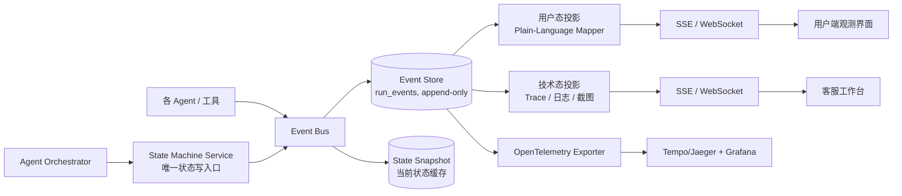

# 面向小白用户的 Agent 观测性设计

> 本文是《AI_DASHBOARD_AGENT_PLAN.md》的补充设计，对应主文档第 22 章。
> 定位：**把 Agent 的执行过程和状态机迁移，从研发专属的黑盒日志，翻译成小白用户看得懂、能行动的实时观测界面；同时为客服/交付人员提供介入与代办能力，协助客户完成大屏开发。**

---

## 1. 为什么观测性是核心能力，而不是运维附属品

主文档第 15 节已有 Prometheus / Grafana 指标，那是**给研发看的系统监控**。本方案的目标用户是**不懂技术的小白**：

- 他们不会看日志、不会调接口、看不懂堆栈和 TypeScript 报错。
- 当 Agent 卡住、失败或需要人工时，他们唯一的感知是"转圈转了很久"或"没反应了"。
- 没有观测性，一次失败 = 一次流失；有了观测性，一次失败 = 一次可解释、可恢复、可求助的过程。

因此观测性在本系统中是**一等公民的产品能力**，设计目标：

1. **看得懂**：用户随时知道"Agent 现在在做什么、进行到哪一步、还要多久"。
2. **卡得住**：任何卡点（阻塞、升级、失败、超时）都会变成用户可理解的提示，而不是静默转圈。
3. **能行动**：每个卡点都给出明确的下一步操作（回答澄清、一键重试、回退版本、呼叫人工）。
4. **可协助**：客服/交付人员能看到与用户完全一致的现场，并可以远程代办动作，全程留痕。

---

## 2. 观测对象：两类状态机 + 一条执行轨迹

系统里可被观测的对象归纳为三类：

### 2.1 Run 状态机（任务级）

一次"生成 / 修改大屏"任务（`agent_runs`）的整体状态机：

```text
RECEIVED
  → PLANNING              （Planner 理解需求）
  → AWAITING_CLARIFICATION（可选：等待用户回答澄清问题）
  → RETRIEVING            （Repository Agent 检索组件与代码）
  → DATA_BINDING          （Data Agent 绑定数据源与指标）
  → CODING                （Frontend Coding Agent 修改源码）
  → BUILDING              （沙箱构建与运行）
  → VERIFYING             （测试 / 截图 / 安全扫描）
  → REPAIRING             （内层原子修复闭环，持有未关闭 Issue 计数）
  → PREVIEW_READY         （预览可用）
  → AWAITING_USER_CONFIRMATION
  → AWAITING_APPROVAL     （需要人工审批时）
  → RELEASING
  → RELEASED

终态：
  COMPLETED   正常完成
  BLOCKED     外部依赖阻塞（数据源不可用、权限不足等）
  ESCALATED   超出自动修复预算，等待人工
  FAILED      不可恢复失败
  CANCELLED   用户取消
```

关键规则：

- **REPAIRING 不是单点状态**：它聚合内层 Issue 修复循环，必须暴露 `openIssues`、`activeIssueId`、`attemptCount` 作为状态属性，供界面展示"还有 2 个问题待修复，正在处理第 1 个"。
- 任意状态 → `BLOCKED / ESCALATED / FAILED / CANCELLED` 的迁移都必须携带 `reasonCode` 和用户可读的 `reason`。

### 2.2 Issue 状态机（问题级）

即主文档 8.1 定义的状态机：

```text
NEW → TRIAGED → REPRODUCING → REPRODUCED → DIAGNOSING → PATCHING → VERIFYING → FIXED
异常终态：BLOCKED / WAIVED / ESCALATED
```

每次迁移、每次 `RepairAttempt`（假设、补丁、验证结果、失败反例）都是观测事件。

### 2.3 Agent 执行轨迹（过程级）

一次 Run 内所有 Agent 的接力与工具调用：

```text
Planner → (提问) → Repository → Data → Coding → [Diagnoser → Fixer → Verifier]×N → Release
```

每次 Agent 接力、每次工具调用（搜组件、查指标、改文件、跑构建、截图）都记录为 step 事件。

---

## 3. 架构：事件溯源 + 双视角投影



### 3.1 三条铁律

1. **状态机单一事实源**：Orchestrator 和各 Agent **不允许直接改状态字段**，一切状态迁移调用 State Machine Service。迁移即事件，事件即界面——不存在"界面猜状态"。
2. **同一事件流，两种投影**：只产生一份事件（含技术细节），用户态投影负责翻译成小白语言，技术态投影原样保留给研发和客服。**用户界面绝不直接消费技术事件。**
3. **卡点即事件**：每个状态配置最大停留时长（dwell budget）。超时未迁移，State Machine Service 自动发出 `state_stalled` 提示事件并降级展示（"比预期久了一点，仍在处理 / 可以点击重试"），杜绝静默转圈。

### 3.2 事件模型（追加到主文档第 16 节）

#### `run_events`（append-only，所有观测的唯一事实源）

```json
{
  "eventId": "evt_01J…",
  "runId": "RUN-001",
  "seq": 128,
  "ts": "2026-07-24T10:15:30Z",
  "traceId": "4bf92f3577b34da6a3ce929d0e0e4736",
  "type": "state_transition | agent_step | tool_call | issue_transition | repair_attempt | stall_warning | user_action | assist_action",
  "actor": "orchestrator | agent:planner | agent:fixer | user | support:U1009",
  "state": { "from": "VERIFYING", "to": "REPAIRING" },
  "refId": "ISSUE-142",
  "payload": { "reason": "2 issues detected", "openIssues": 2 },
  "userMessage": "发现 2 个问题，正在自动修复，预计还需要 1～2 分钟",
  "severity": "info | warning | error"
}
```

- `seq` 保证顺序，支持断线重连后增量补齐（SSE `Last-Event-ID`）。
- `userMessage` 在写入时由 Plain-Language Mapper 生成并固化，避免前端各自翻译不一致。
- `traceId` 关联 OpenTelemetry，实现"用户看到一句话，客服一键跳到完整 Trace"。

#### `agent_steps`

- `id`、`run_id`、`seq`、`agent`、`action`、`input_summary`、`output_summary`、`tool_name`、`duration_ms`、`tokens`、`status`、`error_summary`

#### `assist_sessions`（客服协助会话）

- `id`、`run_id`、`support_id`、`user_id`、`started_at`、`ended_at`
- `actions[]`：代办动作列表（类型、参数、结果），**全部对用户可见**（透明原则）
- 所有代办动作同时写入 `approval_records` 风格的审计记录

---

## 4. 用户态翻译层（Plain-Language Projection）

这是"小白看得懂"的核心。技术事件 → 用户语言采用**模板映射表 + 参数填充**，不允许模型自由发挥（避免翻译不准、术语泄露）。

### 4.1 阶段映射示例

| 技术事件 | 用户看到的文案 |
|---|---|
| `state_transition → PLANNING` | "正在理解你的需求…" |
| `tool_call: search_components` | "正在组件库里查找合适的图表组件" |
| `tool_call: query_metric` | "正在检查「CPU 使用率」这个指标的数据" |
| `state_transition → CODING` | "正在编写大屏页面代码" |
| `state_transition → BUILDING` | "正在构建和启动预览环境" |
| `issue_detected: visual-overflow` | "发现一个小问题：表格超出了屏幕边界" |
| `repair_attempt_started #2` | "第 1 次修复没成功，正在换一种方式再试（第 2 次）" |
| `verification_completed: passed` | "问题已修复并通过自动检查 ✅" |
| `state_transition → PREVIEW_READY` | "大屏已经生成好了，点击预览看看效果" |
| `state_transition → ESCALATED` | "这个问题超出了自动处理能力，已为你通知支持人员，你也可以先回退到上一个可用版本" |

### 4.2 术语黑名单

用户态文案中禁止出现：Stack Trace、TypeError、exit code、diff、worktree、SQL、Token 等技术词。统一映射：

```text
编译/构建失败  → "页面组装时遇到问题"
类型错误      → "代码检查发现不一致"
依赖安装失败  → "所需素材下载失败"
沙箱超时      → "处理时间超出预期"
```

### 4.3 进度与预期管理

- 每个状态配置 `expectedDuration`（P50/P90 历史统计），界面显示阶段进度条而非百分比假象。
- 进度 = 已完成阶段数 / 当前需求的计划阶段数（来自 `ChangePlan`），修复循环以 `已关闭 Issue / 总 Issue` 表示。
- 超过 P90 未迁移 → `stall_warning` → 界面降级提示 + 提供"继续等待 / 重试 / 呼叫人工"。

---

## 5. 用户端观测界面

工作台右侧常驻"执行过程"面板（可折叠），与预览区并排：

```text
┌──────────────────────────┬────────────────────┐
│                          │ ● 正在自动修复问题  │
│                          │ 已进行 3 分 12 秒   │
│        大屏预览区         │ ────────────────── │
│                          │ ✓ 理解需求          │
│                          │ ✓ 查找组件          │
│                          │ ✓ 绑定数据          │
│                          │ ✓ 编写页面          │
│                          │ ● 修复问题（2/3）   │
│                          │   └ 表格超出边界 →  │
│                          │     第 2 次尝试中…  │
│                          │ ○ 生成预览          │
│                          │ ────────────────── │
│                          │ [遇到问题？呼叫人工] │
└──────────────────────────┴────────────────────┘
```

必备交互：

1. **阶段时间线**：阶段级勾选 + 当前阶段实时日志流（用户态文案）。
2. **Issue 卡片**：每个问题一张卡——问题是什么（一句话）、第几次尝试、当前验证状态；FIXED 后展示修复前后对比截图。
3. **卡点行动区**：状态决定按钮——
   - `AWAITING_CLARIFICATION`：内嵌问答卡片，直接回答继续。
   - `BLOCKED`：解释原因 + 引导操作（重新选择数据源 / 联系管理员开通权限）。
   - `FAILED`：「一键回退到上个可用版本」（走 Git Checkpoint）+「重新开始」。
   - `ESCALATED`：「呼叫人工」+ 已通知状态；展示预计响应时间。
4. **历史版本时间线**：每次 Commit 一个节点，任意节点可预览、可回退（对齐主文档第 6 节 Git 工作模型）。
5. **透明度开关**：默认简洁模式；用户可点"查看技术详情"看到事件原文（不隐藏，但默认不打扰）。

---

## 6. 客服 / 交付工作台（Assist Console）

协助客户完成任务的操作台，视角 = 用户看到的 + 技术投影：

1. **协助队列**：自动汇集 `ESCALATED`、`BLOCKED`、`STALLED`（停留超时）、用户主动求助的 Run，按等待时长排序。
2. **现场回放**：完整事件时间线，可在用户态 / 技术态之间切换；每个事件可跳截图、日志、Git Diff、OTel Trace。
3. **状态机视图**：Run 状态机 + 每个 Issue 状态机的可视化（当前节点高亮、迁移路径、各节点停留时长），一眼看出"卡在哪一环、卡了多久、已经试过什么"。
4. **代办动作**（全部审计 + 对用户透明可见）：
   - 代答澄清问题、代调整需求描述后重跑 Planner。
   - 代重试单个 Issue（`POST /issues/{id}/retry`）、代豁免（WAIVED，需记录业务理由）。
   - 代回滚到指定 Commit、代切换 Mock/真实数据源。
   - 代提交审批、代执行发布或回滚。
   - 必要时接管会话（takeover）：暂停 Agent 自动循环，由人工直接编辑补丁后交还 Verifier 验证。
5. **协助结果回流**：每次人工修复沉淀为 Repair Memory 条目（对齐主文档阶段 5），让同类问题下次自动解决——客服工作量应随时间下降，这是观测性的长期收益。

---

## 7. API 增补（追加到主文档第 17 节）

```http
# 当前状态快照：状态、进度、停留时长、下一步可用动作
GET /api/v1/agent-runs/{runId}/state

# 时间线：audience=user 返回用户态投影；audience=operator 返回技术态
GET /api/v1/agent-runs/{runId}/timeline?audience=user&afterSeq=120

# 单个 Issue 的完整状态机历史与修复尝试
GET /api/v1/issues/{issueId}/timeline

# 用户动作
POST /api/v1/agent-runs/{runId}/actions/answer        # 回答澄清
POST /api/v1/agent-runs/{runId}/actions/retry         # 从卡点重试
POST /api/v1/agent-runs/{runId}/actions/rollback      # 回退到指定 commit
POST /api/v1/agent-runs/{runId}/actions/request-help  # 呼叫人工

# 客服工作台
GET  /api/v1/assist/queue
POST /api/v1/assist/{runId}/takeover
POST /api/v1/assist/{runId}/actions/{retry|waive|rollback|edit-patch|release}
```

SSE 事件类型在原 `stage_started`、`issue_detected` 等基础上增补：

```text
state_transition        # 状态机迁移（含 from/to/reason/userMessage）
state_stalled           # 状态停留超时
agent_step              # Agent 接力与工具调用
repair_attempt_updated  # 修复尝试进展
assist_action_taken     # 客服代办动作（对用户透明推送）
next_action_required    # 需要用户操作的卡点（含动作清单）
```

---

## 8. 指标增补（追加到主文档 15.1）

```text
# 状态机健康
run_state_dwell_seconds{state}        # 各状态停留时长分布，定位系统性卡点
run_stalled_total{state}              # 停留超时次数
run_completion_rate                   # 无人工介入完成率（核心北极星）

# 用户侧
user_confusion_signal_total           # 重复点击、反复刷新、中途放弃等行为信号
user_help_request_total               # 主动求助率
clarification_response_duration       # 用户回答澄清耗时

# 协助闭环
assist_queue_depth                    # 待协助队列深度
assist_response_duration              # 求助 → 客服介入耗时
assist_resolution_rate                # 协助后任务完成率
assist_repeat_issue_rate              # 同一类 Issue 被人工重复处理率（应随 Repair Memory 下降）

# 观测性自身质量
event_loss_rate                       # 事件丢失率（目标 0）
user_message_coverage                 # 有用户态文案的事件占比（目标 100%）
```

---

## 9. 分阶段落地（嵌入主文档第 19 节计划）

| 原阶段 | 叠加的观测性交付 |
|---|---|
| 阶段 2（第 3～4 周） | State Machine Service、run_events 事件存储、Run 状态机、SSE 推送、用户端执行时间线 MVP（阶段勾选 + 实时文案） |
| 阶段 4（第 7～8 周） | Issue 状态机可视化、Issue 卡片、修复尝试实时进度 |
| 阶段 5（第 9～10 周） | 修复回放（假设 → 补丁 → 验证 → 反例全链路）、停留超时检测与 stall 提示、一键回退 |
| 阶段 6（第 11～12 周） | 客服工作台、协助队列、代办动作与审计、OTel Trace 双向跳转、观测性指标看板 |

原则不变：**先有事件和状态机，再有界面**。阶段 2 即使没有 UI，事件流也必须先落库——它是后续所有观测界面、协助工具和 Repair Memory 的地基。

---

## 10. 验收标准

| 指标 | 目标 |
|---|---:|
| 任意时刻用户能看到当前阶段与下一步 | 100% |
| 状态静默无反馈超过 60 秒 | 0 次 |
| 卡点事件附带可执行下一步动作 | 100% |
| 事件用户态文案覆盖率 | 100% |
| 客服无需用户提供截图即可还原现场 | 100% |
| 代办动作审计与对用户透明度 | 100% |
| 协助后任务完成率 | ≥90% |
| 同类问题重复人工处理率 | 逐月下降 |
