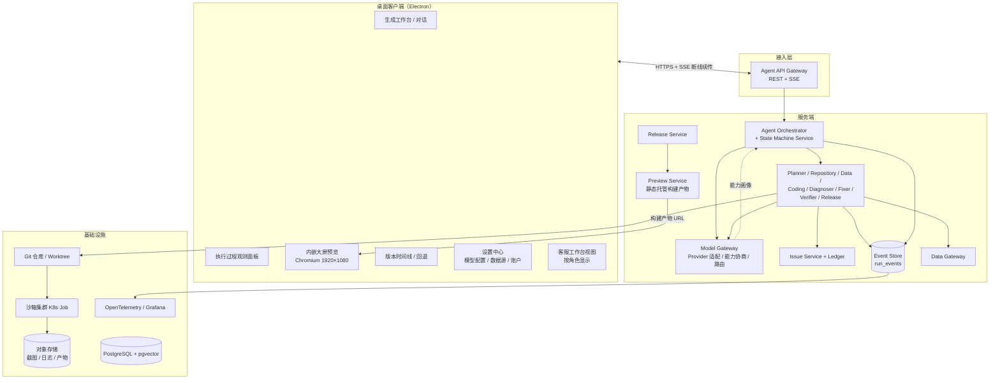

# AI 大屏 Agent 系统设计文档

> 依据：《AI_DASHBOARD_AGENT_PLAN.md》（需求与总体方案）+《AI_DASHBOARD_OBSERVABILITY.md》（观测性设计）。
> 本文档在总体方案基础上，落实两个新增前提的系统设计：
>
> 1. **前端采用桌面客户端方案，不使用 Web 控制台。**
> 2. **模型 API 与 URL 可配置，同时支持多模态与非多模态两类执行流程。**

---

## 0. 设计前提带来的架构变化

| 前提 | 架构影响 |
|---|---|
| 客户端替代 Web | 工作台、预览、观测面板、审批、客服工作台全部收敛到一个桌面客户端；需要本地长连接管理、自动更新、跨端一致性（Windows/macOS）；大屏预览在客户端内嵌 Chromium 中以真实 1920×1080 渲染 |
| 模型可配置 | 引入**模型网关（Model Gateway）**作为所有 Agent 调用模型的唯一入口；Provider、Base URL、API Key、模型名全部配置化，禁止在 Agent 代码中硬编码 |
| 多模态可选 | 系统按**能力画像（Capability Profile）**驱动：每次任务启动时做能力协商，视觉相关环节（截图语义判断、设计稿理解）有多模态 / 非多模态两套确定性路径，流程自动切换，不允许运行期才发现"模型不会看图"而失败 |

不变的部分：大屏**产物**仍是 Web 技术栈（Vue 3 + ECharts），客户端方案只改变工作台形态；后端服务（编排、沙箱、数据网关、Issue Ledger、状态机）总体沿用原计划，本文只写差异与落地细化。

---

## 1. 总体架构



关键决策：

- **厚服务端、瘦客户端**：Agent 编排、沙箱、模型调用全部在服务端。客户端不持有模型 Key（除非单机模式，见 3.6），不执行生成逻辑，只负责交互、观测与预览。好处：模型配置集中管控、客户端升级不影响任务、任务在服务端可断点续跑。
- **Preview Service 独立**：构建产物（静态文件）由 Preview Service 托管并签名 URL 下发，客户端用内嵌 BrowserView 加载。大屏页面与客户端外壳隔离，生成代码的 XSS 风险不波及工作台。

---

## 2. 客户端设计

### 2.1 技术选型：Electron

| 候选 | 结论 | 理由 |
|---|---|---|
| **Electron** | ✅ 选用 | 内嵌完整 Chromium，大屏预览渲染结果与用户真实浏览器一致，视觉验证可信；`BrowserView` 多视图隔离成熟；Vue 3 生态无缝复用；`safeStorage` 可做本地密钥加密；自动更新（electron-updater）成熟 |
| Tauri | 备选 | 体积小，但预览依赖系统 WebView（Windows WebView2 / macOS WKWebView），渲染内核不一致会污染视觉回归基线；多窗口视图隔离能力弱 |
| Qt / 原生 | 排除 | 前端组件库与工作台 UI 无法复用 Vue 生态，成本过高 |

客户端自身技术栈：Electron + Vue 3 + TypeScript + Vite + Pinia + Element Plus（工作台 UI 库，与大屏组件库隔离）。

### 2.2 进程架构

```text
Main Process（Node）
  ├── 窗口 / BrowserView 管理（工作台窗口 + 预览视图）
  ├── SessionManager：REST 客户端 + SSE 长连接（断线重连、Last-Event-ID 续传）
  ├── UpdateManager：自动更新、差量包
  ├── SecureStore：safeStorage 加密本地配置（单机模式密钥）
  └── IPC 网关：白名单通道，renderer 不直接持有 Node 能力

Renderer Process（工作台 UI）
  ├── 对话生成区
  ├── 执行过程观测面板（消费 SSE 用户态投影）
  ├── Issue 卡片 / 修复回放 / 卡点行动区
  ├── 版本时间线（Commit 节点、预览、回退）
  └── 设置中心（模型 / 数据源 / 主题）

Preview BrowserView（隔离视图）
  └── 加载 Preview Service 签名 URL，固定 1920×1080 视口，可切换 2560×1440
```

安全约束：Renderer `nodeIntegration: false`、`contextIsolation: true`；预览视图与工作台不同 session、不同 partition，禁用预览页面向工作台发消息（仅允许只读 postMessage 白名单，如高度上报）。

### 2.3 长连接与断线续传

- SSE 通道：`GET /api/v1/agent-runs/{runId}/events`，携带 `Last-Event-ID`（对应观测性设计中的 `seq`）。
- SessionManager 负责指数退避重连（1s→2s→…→30s 封顶），重连后按 `seq` 增量补齐事件，观测面板**不允许出现事件空洞**。
- 客户端掉线期间任务在服务端继续执行；重连后先拉 `GET /state` 快照对齐，再补事件流。

### 2.4 角色与视图

同一客户端安装包，按登录角色切换视图：

| 角色 | 视图 |
|---|---|
| 业务用户（小白） | 工作台 + 用户态观测面板 + 版本时间线 |
| 客服 / 交付 | 以上 + Assist Console（协助队列、技术态回放、代办动作） |
| 管理员 | 以上 + 模型 Provider 管理、数据源注册、审批中心 |

### 2.5 分发与更新

- electron-updater + 私有更新服务器；安装包签名。
- 灰度发布客户端本身（按租户 / 用户分组推送版本）。
- 版本兼容：客户端上报 `clientVersion`，服务端拒绝过旧客户端写操作（只读可用）。

### 2.6 跨平台兼容（Windows / macOS / Linux）

客户端必须三端一致可用。Electron 单一代码库天然支持，但以下各点需要显式设计，不能依赖默认行为：

#### 支持矩阵

| 平台 | 版本 | 架构 | 安装包格式 |
|---|---|---|---|
| Windows | Windows 10 及以上 | x64 | NSIS 安装包（支持静默安装，便于企业批量分发） |
| macOS | macOS 12 及以上 | x64 + arm64（双包或 universal2） | DMG + ZIP（自动更新用 ZIP） |
| Linux | Ubuntu 20.04+ / 主流发行版 | x64 | AppImage（免安装、支持自动更新）+ deb + rpm |

#### 构建与签名

- electron-builder，CI 三平台构建矩阵（Windows / macOS / Linux runner 各一），同一次发版三端产物版本号一致。
- Windows：代码签名证书（EV 证书消除 SmartScreen 拦截）；macOS：Developer ID 签名 + 公证（notarize），否则 Gatekeeper 拦截；Linux：提供 SHA256 校验和。
- 自动更新：Windows / macOS 走 electron-updater；Linux 仅 AppImage 支持应用内自动更新，deb / rpm 更新提示用户走包管理器或下载新包。

#### 系统能力差异适配

| 能力 | Windows | macOS | Linux |
|---|---|---|---|
| 本地密钥存储（`safeStorage`） | DPAPI | Keychain | libsecret（gnome-keyring / kwallet）；**无 keyring 环境降级**为加密文件 + 首次启动明示风险 |
| 桌面通知 | 通知中心 | 通知中心（需签名才稳定） | libnotify；部分精简桌面无通知服务，应用内消息中心兜底 |
| 窗口装饰 | 原生标题栏 | 原生 + 红绿灯按钮区 | 原生；Wayland / X11 均测试 |
| 快捷键 | Ctrl 系 | Cmd 系 | Ctrl 系 |

原则：**平台差异收敛在 Main Process 适配层**，Renderer（Vue UI）不写任何平台分支代码。

#### 预览渲染一致性（重点）

三端截图与视觉验证基线必须可比：

- 渲染内核：Electron 自带 Chromium，三端内核版本一致，DOM / CSS / ECharts 行为一致。
- **字体是最大差异源**（DirectWrite / CoreText / FreeType 的抗锯齿与度量差异会导致像素级 diff 误报）：大屏工程**内嵌字体包**（随构建产物下发，Preview Service 托管），预览视图强制使用内嵌字体；像素 diff 基线仍按 `平台 × 分辨率` 分组存储，跨平台只做 DOM 几何 Oracle 对比，不做像素基线混用。
- HiDPI / 缩放：预览视图固定 `devicePixelRatio=1` 逻辑渲染，避免系统缩放污染截图基准。

#### 三端测试矩阵（纳入 CI 与验收）

每端必跑冒烟套件：安装与启动、自动更新、SSE 断线续传、预览渲染（DOM Oracle 断言）、密钥存储读写、桌面通知、最小窗口 1200×720 布局。发布门禁要求三端冒烟全绿。

---

## 3. 模型网关（Model Gateway）设计

所有 Agent（Planner、Coding、Diagnoser……）**不直接调用模型**，统一走 Model Gateway。

### 3.1 职责

1. **Provider 适配**：OpenAI 兼容协议 / Anthropic / 国产厂商私有协议，统一为内部 `ChatRequest` 抽象。
2. **配置管理**：Base URL、API Key、模型名、超时、重试、并发限额，全部配置化、可热更新。
3. **能力画像**：声明 + 探测每个模型端点的能力（见 3.3）。
4. **路由**：按 Agent 角色 × 能力需求选择模型端点（例：Coding 需要 tool_calling + 长上下文；视觉验证需要 vision）。
5. **韧性**：超时、限流退避、按优先级降级到备选端点、熔断。
6. **审计与配额**：每次调用的 token、耗时、成本落库，关联 `traceId` 与 `runId`。

### 3.2 配置模型

两级配置，后者覆盖前者：

- **部署级**（管理员，服务端）：可用 Provider 池、默认路由策略、配额。
- **租户 / 用户级**（设置中心 UI 可改）：选择 Provider、覆盖 Base URL / Key / 模型名、按角色指定模型。

```yaml
# model-gateway 配置示例
providers:
  - id: openai-main
    type: openai-compatible
    baseUrl: https://api.openai.com/v1
    apiKeyRef: vault:prod/openai          # 密钥引用，不落地明文
    models:
      - name: gpt-4o
        capabilities: [chat, tool_calling, vision, json_mode]
        contextWindow: 128000
  - id: company-internal
    type: openai-compatible
    baseUrl: https://llm.internal.example.com/v1
    apiKeyRef: vault:prod/internal
    models:
      - name: qwen2.5-72b-instruct
        capabilities: [chat, tool_calling, json_mode]   # 无 vision
        contextWindow: 131072

routing:
  planner:       { prefer: [company-internal, openai-main], require: [tool_calling] }
  frontendCoder: { prefer: [company-internal, openai-main], require: [tool_calling] }
  diagnoser:     { prefer: [openai-main], require: [] }     # vision 可选，见双流设计
  vision:        { prefer: [openai-main], require: [vision] } # 无可用端点时触发非多模态流程

resilience:
  timeoutMs: 60000
  retries: 2
  fallbackOn: [rate_limit, server_error, timeout]
```

### 3.3 能力画像（Capability Profile）

每个模型端点的能力 = **声明配置 + 启动探测**：

```json
{
  "endpointId": "company-internal/qwen2.5-72b-instruct",
  "capabilities": {
    "chat": true,
    "toolCalling": true,
    "vision": false,
    "jsonMode": true,
    "maxContext": 131072,
    "maxOutput": 8192
  },
  "probe": { "lastCheckedAt": "…", "visionProbe": "unsupported", "latencyMs": 420 }
}
```

- 探测：网关启动和配置变更时，对每个端点发探针（一次最小 tool_calling 请求、一次 1×1 像素图片请求），验证声明是否属实；不支持的自动标记降级。
- 每次 `agent_run` 启动时，Orchestrator 向网关索取**本次任务的能力画像**（`multimodal: true/false` + 各角色实际选中的端点），写入 `agent_runs.capability_profile`——这决定了走哪条流程，并且在观测面板可见（"当前使用纯文本模式，视觉检查采用 DOM 检测"）。

### 3.4 Agent 角色的能力需求矩阵

| Agent | 必需能力 | 可选能力 |
|---|---|---|
| Planner | chat、tool_calling | — |
| Repository | chat、tool_calling | — |
| Data | chat、json_mode | — |
| Frontend Coding | chat、tool_calling、长上下文 | — |
| Diagnoser | chat | vision（有则看图，无则看 DOM/日志文本） |
| Fixer | chat、tool_calling | — |
| Verifier | 主要是确定性程序 | vision（仅视觉语义判读用） |
| Release | chat | — |

---

## 4. 多模态 / 非多模态双流设计

### 4.1 哪些环节依赖"看图"

| 环节 | 多模态流程（有 vision） | 非多模态流程（无 vision） |
|---|---|---|
| 用户上传设计稿 / 参考截图生成大屏 | VLM 直接理解图片，提取布局、配色、指标 | **入口降级**：禁用图片上传入口并明示原因；引导用户用自然语言 + 主题模板描述 |
| Visual Gate 视觉检查 | 截图 → VLM 语义判读（美观、遮挡、主题一致性） | **双判据替代**：① DOM 几何 Oracle（遮挡 / 溢出 / 截断，确定性，原计划 13.1 已覆盖）；② pixelmatch 像素级 diff 对比基线截图（检测非预期变化，不做语义判读） |
| 视觉类 Issue 诊断（如"图表看起来挤"） | Diagnoser 看截图定位 | DOM 快照 + computed style + console 日志序列化为结构化文本给 Diagnoser；必要时输出 `NEEDS_HUMAN_VISUAL` 升级人工 |
| 审美 / 风格类主观验收 | VLM 打分 + 人工确认 | **不自动判**，直接进入用户预览确认环节（小白用户自己看，本来就是终裁） |
| 图表渲染正确性 | VLM 读图 | 校验 ECharts option 对象 + SVG/Canvas DOM 结构 + 数据点数量断言（确定性） |

设计原则：**多模态是增强，不是依赖**。所有"必须过"的门禁（Build / Type / Unit / E2E / Layout / Security）本来就全部是确定性程序判据，不依赖 VLM；VLM 只用于"语义增强判断"，缺失时由确定性判据 + 用户人工确认兜住。

### 4.2 任务启动时的能力协商

```text
创建 Run
  → Model Gateway 解析租户/用户配置
  → 按路由表为每个角色选定端点
  → 汇总 capability_profile { multimodal: bool, endpoints: {...} }
  → Orchestrator 按画像装配本轮工具集：
      multimodal=true  → 启用 screenshot_analyze 工具、设计稿上传入口
      multimodal=false → 启用 dom_snapshot / computed_style_probe / pixel_diff 工具，
                         禁用图片上传，Visual Gate 切到 DOM Oracle + 像素 diff
  → capability_profile 写入 agent_runs，SSE 推送用户：
      "已启用视觉理解模式" / "当前为纯文本模式，布局检查使用结构化检测"
```

### 4.3 非多模态流程的时序（以修复视觉溢出问题为例）

```text
Verifier（程序）
  → DOM 几何检查发现 AlertTable scrollWidth > clientWidth
  → 登记 Issue（证据：bounding box 数值 + 截图存档但不送模型）

Diagnoser（纯文本模型）
  → 输入：结构化 DOM 片段、computed style、相关源码、ECharts option
  → 输出根因假设（列宽总和超容器）

Fixer → 最小补丁 → Verifier 重新跑 DOM Oracle → 关闭
```

同一问题在多模态流程中只是 Diagnoser 多一张截图输入，**Issue Schema、判据、门禁完全一致**——双流共享同一套 Loop Engineering 骨架，切换不产生分支维护成本。

### 4.4 运行期切换

- 用户可在设置中切换模型配置；**进行中的 Run 不切换**（保证一轮任务内行为一致），新配置从下一个 Run 生效，界面上明确提示。
- 多模态端点运行期故障（熔断）时：当前 Run 内 vision 工具自动降级到 DOM Oracle 路径，并向用户推送提示事件（观测性设计中的 `state_stalled` 同类机制）。

---

## 5. 服务端设计（差异部分）

总体沿用原计划第 3、4、6～14 节，以下是与两个前提相关的差异点。

### 5.1 Agent Orchestrator

- 新增与 Model Gateway 的协商步骤（4.2），`capability_profile` 驱动工具装配。
- Planner 的澄清问题生成要考虑能力：非多模态模式下用户需求若只有一张图，第一轮澄清就引导文字描述。

### 5.2 沙箱与采证

- 截图仍然**无条件采集**（Playwright），因为：① 用户态 Issue 卡片要展示修复前后对比；② 后续切到多模态模式可回放；③ 像素 diff 需要。截图与是否多模态无关。
- 沙箱内新增确定性采证工具：`dom_snapshot`（序列化关键子树 + computed style）、`pixel_diff`（对基线截图）、`a11y_tree`，作为非多模态流程的"眼睛"。

### 5.3 Preview Service

- 托管每次构建产物（按 `runId/commit` 目录隔离），生成短时签名 URL。
- 客户端预览视图加载签名 URL；URL 过期自动刷新。
- 支持 `?viewport=1920x1080|2560x1440` 参数供多分辨率检查。

### 5.4 观测性集成

- 客户端观测面板 = 观测性设计文档第 5 节的实现载体：消费用户态投影 SSE。
- Assist Console 以角色视图形式内嵌同一客户端（2.4），不再单独做 Web 版审批控制台——原计划 `apps/web-console`、`apps/approval-console` 合并为客户端模块，仓库结构对应调整：

```text
apps/
  ├── desktop-client/          # Electron 主工程（工作台 + 观测 + 客服 + 管理）
  │   ├── src/main/            # 主进程：窗口 / SSE / 更新 / 安全存储
  │   ├── src/renderer/        # Vue 3 工作台 UI
  │   └── src/preload/
  ├── dashboard-runtime/       # 大屏产物运行时模板（被生成项目复用）
  └── preview-service/
```

### 5.5 单机 / 私有化形态（可选交付模式）

两类部署共用同一套代码：

- **标准 SaaS / 私有化服务端**：客户端 → 服务端集群，模型 Key 存服务端 Vault。
- **单机演示模式**：客户端 + 本地轻量服务（docker-compose：orchestrator、model-gateway、preview-service、PostgreSQL），模型 Key 存客户端 `safeStorage`。架构上靠 API Gateway 地址可配置支持，不做功能阉割。

---

## 6. 数据模型与 API 增补

### 6.1 数据模型（追加到原计划第 16 节）

#### `model_endpoints`

- `id`、`tenant_id`（null = 平台级）、`type`、`base_url`、`api_key_ref`
- `model_name`、`capabilities`（jsonb）、`probe_status`、`enabled`
- `created_by`、`created_at`、`updated_at`

#### `model_routes`

- `id`、`tenant_id`、`role`（planner / frontendCoder / diagnoser / vision / …）
- `prefer_endpoint_ids[]`、`require_capabilities[]`、`fallback_policy`

#### `model_calls`（审计）

- `id`、`run_id`、`trace_id`、`agent_role`、`endpoint_id`
- `prompt_digest`（不存明文 prompt 的敏感部分，存摘要 + 对象存储引用）
- `input_tokens`、`output_tokens`、`latency_ms`、`status`、`error_code`、`created_at`

#### `agent_runs` 增补字段

- `capability_profile`（jsonb）：本次任务的能力画像与实选端点
- `client_version`：发起任务的客户端版本

### 6.2 API（追加到原计划第 17 节）

```http
# 模型端点与路由（管理员 / 租户级）
GET    /api/v1/model-endpoints
POST   /api/v1/model-endpoints
PUT    /api/v1/model-endpoints/{id}
POST   /api/v1/model-endpoints/{id}/probe      # 手动触发能力探测
GET    /api/v1/model-routes
PUT    /api/v1/model-routes/{role}

# 当前生效能力画像（客户端设置页展示用）
GET    /api/v1/model-gateway/effective-profile

# 客户端元信息
GET    /api/v1/client/latest-version?channel=stable   # 自动更新
```

设置中心 UI 字段（面向小白，只做最少必要暴露）：服务商下拉、API 地址、API Key、模型名、「测试连接」按钮（背后调 `/probe`，用大白话反馈结果："连接成功，支持图片理解" / "连接成功，当前模型不支持图片，视觉检查将使用结构化检测"）。

---

## 7. 安全设计增补

1. **Key 不落明文**：服务端 Vault / KMS 引用；单机模式用 Electron `safeStorage`；日志、事件流、`run_events` 中禁止出现 Key 与完整 Prompt 敏感段（Secret 扫描覆盖事件存储）。
2. **Base URL 白名单**：管理员可锁定允许的 Base URL 域（防止租户把数据指到不可信端点）；私有化部署可放开。
3. **Prompt 出域审计**：`model_calls` 记录每次调用的端点归属，数据出域（境内模型 / 境外模型）形成审计报表。
4. **客户端**：CSP、`contextIsolation`、预览视图隔离（2.2）；自动更新包签名校验。
5. 其余沿用原计划第 14 节（Prompt Injection、沙箱、供应链）。

---

## 8. 关键指标增补

```text
model_call_total{endpoint, role, status}
model_call_latency_seconds{endpoint, role}
model_call_token_total{endpoint, role}
model_endpoint_probe_failed_total
model_fallback_total{from_endpoint, reason}     # 降级 / 熔断切换次数
run_capability_mode_total{mode=multimodal|text_only}
visual_gate_method_total{method=vlm|dom_oracle|pixel_diff|human}
client_sse_reconnect_total
client_version_distribution
```

---

## 9. 分阶段实施（对齐原计划第 19 节）

| 阶段 | 本设计叠加的交付 |
|---|---|
| 阶段 1（1～2 周） | Electron 客户端骨架（登录、对话壳、内嵌预览视图）；模型网关最小版（单 Provider 适配 + 配置化 baseUrl/Key/model） |
| 阶段 2（3～4 周） | SSE 断线续传 + 观测面板 MVP；能力画像与 `capability_profile` 落库；设置中心模型配置页 + 测试连接 |
| 阶段 3（5～6 周） | 数据源配置进客户端设置中心 |
| 阶段 4（7～8 周） | 非多模态采证工具链（dom_snapshot / pixel_diff / a11y_tree）进沙箱；双流工具装配 |
| 阶段 5（9～10 周） | Visual Gate 双判据（VLM / DOM Oracle + 像素 diff）与降级逻辑；修复回放界面 |
| 阶段 6（11～12 周） | Assist Console 角色视图；自动更新与灰度分发；单机演示模式打包；模型调用审计报表 |

---

## 10. 关键设计决策汇总

| # | 决策 | 理由 |
|---|---|---|
| D1 | 客户端选 Electron 而非 Tauri / 原生 | 预览内核一致性是视觉验证可信的前提；Vue 生态复用 |
| D2 | 厚服务端、瘦客户端 | 模型 Key 集中管控；任务服务端续跑；客户端升级与任务解耦 |
| D3 | 所有模型调用经 Model Gateway，能力画像驱动流程 | 可配置、可审计、多 / 非多模态切换不侵入 Agent 逻辑 |
| D4 | 多模态是增强不是依赖；必过门禁全部确定性 | 非多模态模型下系统核心闭环（构建 / 测试 / 布局 / 安全）不受损 |
| D5 | 双流共享同一 Issue / Loop 骨架，仅工具集不同 | 避免两套流程的分支维护成本 |
| D6 | 截图无条件采集 | 用户态证据展示、像素 diff、模式切换后回放都需要 |
| D7 | 审批与客服能力并入客户端角色视图 | 前提要求不做 Web 控制台；减少维护面 |
| D8 | 客户端三端兼容：单一代码库 + 平台差异收敛在 Main 适配层；字体随产物内嵌、像素基线按平台分组 | 三端体验一致；字体是跨平台视觉 diff 最大误差源，必须内嵌 |
