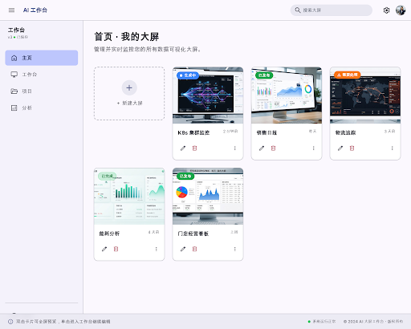
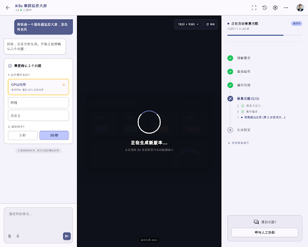

# AI 大屏工作台（AI Dashboard）

> 用自然语言描述需求，AI 自动生成 1920×1080 数据可视化大屏并实时预览的桌面工作台。

[](LICENSE)
[](https://nodejs.org)
[](https://vuejs.org)
[](https://www.electronjs.org)

用户在对话区用中文大白话描述想要什么大屏（"来一个物流监控大屏，要有地图和运单趋势"），
Agent（Planner / Coder，走真实大模型）规划布局、生成自包含 HTML 并实时预览；
生成过程中遇到信息不足会主动追问，出现问题会给出可点的处理卡片，支持版本回退与一键发布。




## 特性

- **对话式生成**：自然语言描述 → Planner 规划 → Coder 生成 1920×1080 自包含 HTML（禁止外部资源引用）
- **实时预览**：SSE 事件流推送执行进度，`<iframe>` 等比缩放实时渲染
- **主动澄清**：信息不足时 Run 进入 `awaiting_clarification`，通过卡片选项补充需求
- **质量闭环**：确定性校验 + LLM 结构化审查 + 自动修复循环（≤2 次），问题以卡片形式给出可执行选项
- **版本管理**：每次生成落一个版本，支持预览、回退、发布
- **断线续传**：事件溯源（jsonl append-only），SSE 支持 `Last-Event-ID` 补发，重启恢复
- **无 Key 可跑**：内置剧本驱动 Mock 引擎 + OpenAI 兼容 stub 模型，零成本体验全流程

## 技术栈

| 包 | 技术 |
| --- | --- |
| `client/` | Electron 37 + Vue 3（`<script setup>`）+ TypeScript + Pinia + Vue Router（hash）+ Tailwind CSS v4 + Vite |
| `server/` | Node + Express + TypeScript，HTTP + SSE，JSON 文件持久化（无数据库），端口 8787 |

## 快速开始

要求：Node.js ≥ 20。

```bash
# 一键起服务端(:8787) + Electron 客户端（自动安装依赖）
./scripts/dev.sh
```

或使用根目录便捷脚本：

```bash
npm run setup   # 安装 client 与 server 依赖
npm run dev     # 同 ./scripts/dev.sh
```

### 无 Key 体验（Mock 模式）

不设置 `VITE_API_BASE` 时，客户端自动使用内置 Mock 引擎（剧本驱动），无需启动服务端：

```bash
cd client && npm run electron:dev
```

### 无真实大模型联调（stub LLM）

```bash
node server/scripts/stub-llm.mjs 9100   # OpenAI 兼容假模型（--no-vision 模拟不支持看图）
```

然后在客户端「设置」里填：地址 `http://127.0.0.1:9100/v1`，Key 任意，模型 `stub-1`。

### 接真实大模型

在客户端「设置」页填写任意 OpenAI 兼容服务的地址 / API Key / 模型名即可。
模型网关会自动探测能力（chat + 1px vision 探针），provider 错误码会映射成大白话提示。

## 常用命令

| 命令 | 说明 |
| --- | --- |
| `npm run dev` | 一键起服务端 + Electron（根目录） |
| `npm run typecheck` | 两端类型检查（`vue-tsc` + `tsc --noEmit`），提交前必过 |
| `npm run smoke` | 端到端冒烟（stub LLM 全流程，无需真实 Key）——本仓库唯一的"测试" |
| `npm run build` | 构建客户端（渲染层 + Electron 主进程）与服务端 |

没有单元测试框架；验证手段是服务端 `npm run smoke`（断言式冒烟）与客户端类型检查。

## 项目结构

```
ai-dashboard/
├── client/                 # Electron + Vue 3 客户端
│   ├── src/
│   │   ├── api/            # ClientApi：mock/（剧本引擎）与 http/（HTTP+SSE）双实现，按 VITE_API_BASE 切换
│   │   ├── stores/         # Pinia：dashboards / session / chat / settings（UI 只读 store、只调 action）
│   │   ├── types/index.ts  # 业务类型唯一定义（契约源头）
│   │   └── styles/tokens.css  # 设计令牌（颜色/圆角/阴影/字体唯一来源）
│   └── electron/           # 主进程与 preload
├── server/                 # Express 服务端
│   ├── src/gateway.ts      # 模型网关：OpenAI 兼容、超时重试、能力探测、容错提取
│   ├── src/orchestrator.ts # Run 五态状态机、Planner/Coder、校验+修复循环、发布/回退/人工协助
│   ├── src/store.ts        # JSON 持久化 + 事件 jsonl（事件溯源）+ SSE 广播
│   └── src/wire.ts         # 线协议类型，import type 自 client（禁止改名）
├── scripts/dev.sh          # 一键开发脚本
├── stitch-reference/       # 视觉基准 HTML + 截图
└── docs（根目录各 MD）      # 设计事实源（见下）
```

## 文档

设计文档是本仓库的事实源，改动前先读：

- [`API_CONTRACT_HTTP.md`](API_CONTRACT_HTTP.md) — 两端 API 契约**唯一事实源**
- [`AI_DASHBOARD_CLIENT_UX.md`](AI_DASHBOARD_CLIENT_UX.md) — 交互与文案基准
- [`AI_DASHBOARD_SYSTEM_DESIGN.md`](AI_DASHBOARD_SYSTEM_DESIGN.md) — 系统设计
- [`AI_DASHBOARD_AGENT_PLAN.md`](AI_DASHBOARD_AGENT_PLAN.md) — Agent 规划
- [`AI_DASHBOARD_OBSERVABILITY.md`](AI_DASHBOARD_OBSERVABILITY.md) — 可观测性
- [`client/CONTRACT.md`](client/CONTRACT.md) — 客户端协作铁律（文案、设计令牌、组件约定）
- [`server/README.md`](server/README.md) — 服务端细节

## 环境变量

| 变量 | 位置 | 默认 | 说明 |
| --- | --- | --- | --- |
| `VITE_API_BASE` | client | 空 = Mock 模式 | 存在时客户端走真实服务端，如 `http://localhost:8787`（见 `client/.env.example`） |
| `PORT` | server | `8787` | 服务端监听端口 |
| `DATA_DIR` | server | `server/data/` | 持久化目录（dashboards / settings / sessions / events / previews） |
| `AGENT_STEP_MAX_MS` | server | 20 分钟 | 单步看门狗；编码超时自动拆分骨架 + 逐面板生成 |
| `SMOKE_PORT` / `STUB_PORT` / `VERBOSE` | server 脚本 | 自动 | 冒烟与 stub 模型调试 |

## 安全提示

本项目为**单用户演示形态**：API Key 明文落本地文件 `server/data/settings.json`（已 gitignore）。
请勿将该文件提交到仓库，勿将本项目原样用于生产；生产环境应换密钥引用（vault）或加密存储。

## 已知缺口（一期遗留）

- 重启后 generating/assisting 落回 idle（blocked/awaiting 靠 pendingRun 最大努力续跑）
- 协助修复为确定性清洗兜底；Issue 截图对比用封面占位；stall 卡点未实现
- 二期待定决策：C5 指哪改哪、C7 语音输入

## 贡献

欢迎 Issue 与 PR！请先阅读 [CONTRIBUTING.md](CONTRIBUTING.md)（开发环境、契约优先规则、提交前检查）。

## 许可证

[MIT](LICENSE)
