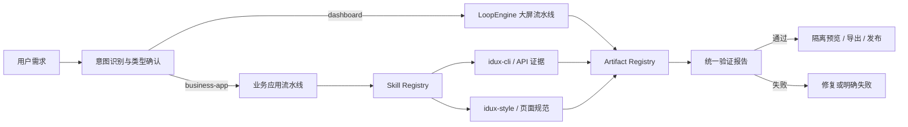
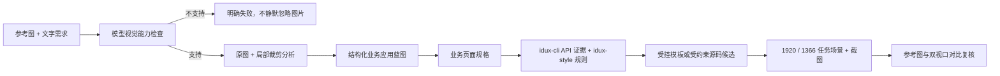

# 多产物生成架构

## 目标

同一个工作台支持两类边界明确的产物：

- `dashboard`：固定画布的数据大屏，由 LoopEngine 驱动分析、取数、生成、视觉检查和修复。
- `business-app`：可交互的企业业务应用，支持列表、详情、表单和业务操作，固定验收 1920×1080 与 1366×768 两档桌面视口；当前由 Vue + Vite + IDux 实现，`idux-cli` 约束组件 API 与版本，`idux-style` 约束设计令牌、页面模式和密度。

项目创建后锁定 `artifactKind`。后续消息、回答、回退、构建、验证、预览、导出和发布全部按该类型路由，不允许在处理中静默切换生成器。旧 `/dashboards` API 只作为兼容入口；新能力使用 `/projects`，创建时必须显式传入类型。

## 分层

### Project

`Project` 是用户工作单元，保存名称、状态、`artifactKind` 和对应 `TargetProfile`。类型是路由依据，不从消息内容反复猜测。

### Artifact / Revision

每次成功生成形成不可变 Revision，并携带：

- `ArtifactManifest`：入口、文件清单、产物类型和导出格式。
- `ValidationReport`：所有确定性和运行时门禁的结果。
- 构建产物与可复现源码；业务应用另外保存依赖版本和技能证据。

失败或校验未通过的草稿不进入版本历史。

### Artifact Registry

每种产物通过 Adapter 提供目标配置、Manifest、确定性校验和导出命名。新增产物类型时必须先实现 Adapter，不在路由或 UI 中堆叠特例。

### Skill Registry

技能位于 `server/skills/<skill-id>`。Registry 校验 `SKILL.md` frontmatter 与 `skill.config.json`，并依据 `artifactKinds` 精确匹配产物。技能命令通过无 shell 的白名单执行器运行，限制工作目录、环境变量、超时和输出大小。

业务应用使用职责不同的两个技能：

- `idux-cli` 提供与目标版本一致的 props、slots、events、methods 和 demo 证据，不负责决定页面视觉。
- `idux-style` 保存官方设计基线、双视口合同、页面模板、设计令牌和有界修复样式，不执行命令。

`generator.ts` 仍然是必要的编排与安全边界，但只负责校验两类证据、规划受控页面规格、装配模板和生成可追溯产物。业务模板、页面 CSS、规格解析和修复策略分别位于 skill 资源、`spec.ts`、`style-kit.ts` 与 `repairer.ts`，避免生成器再次膨胀成不可测试的“大文件”。

### 业务应用参考图生成

业务应用与大屏一样支持参考图驱动，但不能把图片直接交给任意代码生成器。受控链路为：

文字需求决定业务对象和任务，参考图决定导航方向、概览数量、内容密度、表面层级和工具栏排列。当前图片分析器接受可可靠识别的管理列表结构，并可在文字需求要求时叠加列表到详情的任务流；遇到大屏、登录页、复杂表单或不可辨认图片时明确拒绝，避免输出看似完成但类型错误的页面。导出证据只保存图片哈希和分析哈希，不保存图片本体或原始视觉清单。

业务应用 Loop 会持久化累计需求、未完成候选、失败原因和已经尝试的策略。“继续”恢复同一目标，不会退化为只拼接首条与末条消息的新生成。修复顺序为确定性规则、受约束模型源码修复、定向重生成和证据扩展重规划；只有全部策略均未通过门禁时才进入人工选择。

## 三条不可降级的质量线

### 准确性

- 结构化意图路由：明确的普通表格、管理列表进入 `business-app`；大屏需求进入 `dashboard`；模糊需求先澄清。
- 真实数据与模型生成代码分离保存，模型只看到必要的数据形状；预览响应时才安全内联事实数据。
- IDux 依赖使用精确版本，保存版本、上游提交和证据哈希；模型可生成受约束页面规格或批准目录内的源码候选，但候选不能绕过静态、构建、网络、双视口和任务场景门禁。
- 每个 Revision 必须有 Manifest 和通过的 ValidationReport，发布端再次执行门禁。

### 体验性

- 首页显式选择“大屏”或“业务应用”，卡片和工作台持续展示类型，避免生成结果与预期不一致。
- 数据大屏保留实时局部预览、阶段状态、问题修复和断源处置；业务应用分别在 1920×1080 和 1366×768 验证控制台、关键内容、首屏可用性和需求驱动交互（例如打开所选记录详情并返回）。
- 回退复制完整多文件产物，不修改历史版本；业务应用导出提供可复现源码 ZIP。

### 安全性

- 生成代码不能直接执行任意命令；业务应用源文件、导入、运行时 API、构建目录和输出大小均有白名单。
- 预览运行在独立 origin 和 sandbox iframe 中；响应使用严格 CSP，`connect-src 'none'`，禁止表单、跳转、对象和子框架。
- Dashboard 仅可声明 `fetch('./data.json')` 作为离线回退；其他网络 API 在进入版本前失败。预览时数据已内联，因此不会产生网络读取。
- 模型、MCP 和发布密钥在 API 返回与持久化前统一遮罩/恢复；本地敏感文件使用受限权限和原子写入。
- 发布只接受验证通过的 Revision；配置缺失或资产不可信时明确失败，不生成伪发布地址。

## 扩展规则

新增产物类型必须同时交付：

1. `ArtifactKind`、TargetProfile 和 Adapter。
2. 明确的意图规则与创建时类型确认。
3. 受控生成器或技能，以及权限和依赖证据。
4. 确定性校验、真实浏览器运行校验和失败处理。
5. 隔离预览、可复现导出、发布前复检和安全审计。
6. 覆盖正确路由、生成、回退、重启恢复和越权失败的端到端测试。

任何新增能力不能绕过 Registry、ValidationReport 或隔离预览直接交付产物。
